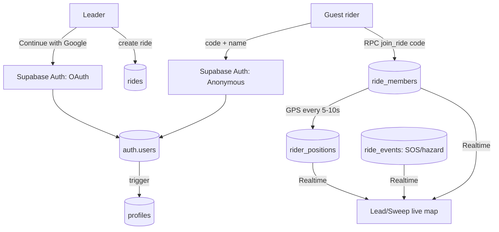

# RideInSync — Architecture (Supabase + Google login)

Reference for the hackathon build. Read with `PRD/PRD.md`, `Agents.md`, and `design/`.
Scope here = the **demo MVP**: one route-based group ride, join by code/QR, live GPS,
simple group status, manual rider status, SOS/hazard signals.

---

## 1. Stack

| Layer | Choice |
| --- | --- |
| Frontend | React + Vite + TypeScript, served as a **PWA** (`vite-plugin-pwa`) |
| Auth | **Supabase Auth** — Google OAuth (leader) + Anonymous (guest riders) |
| Database | **Supabase Postgres** with Row-Level Security |
| Realtime | **Supabase Realtime** (`postgres_changes`) per ride |
| Maps | **Google Maps** — maps / traffic / weather (wired later, not in this doc) |
| Config | `.env.local` (see `.env.example`) — never commit keys |

---

## 2. Identity model — leader logs in, riders join as guests

Two ways to get a session; **both produce a `auth.users` row**, so both get a `profiles`
row and `auth.uid()` works uniformly in RLS.

- **Leader** → `supabase.auth.signInWithOAuth({ provider: 'google' })`. Owns the ride.
- **Guest rider** → enters a join code + a display name →
  `supabase.auth.signInAnonymously({ options: { data: { display_name } } })`, then joins.

A guest is just a `profiles` row with `is_guest = true`. Because the schema treats guests
and Google users identically, we can later let a guest **upgrade** to Google
(`linkIdentity`) without touching the data model. That's why Option B is safe to start with.



---

## 3. Data model

Full position **history** is retained (leader-set retention window); the live map reads the
latest ping per rider from that same stream.

### `profiles` — one per auth user
| col | type | notes |
| --- | --- | --- |
| `id` | uuid PK | = `auth.users.id` |
| `display_name` | text | from Google, or the name a guest typed |
| `avatar_url` | text null | Google avatar; guests have none |
| `is_guest` | bool | true for anonymous sessions |
| `created_at` | timestamptz | |

### `rides`
| col | type | notes |
| --- | --- | --- |
| `id` | uuid PK | |
| `code` | text unique | short join code (e.g. 6 chars) |
| `name` | text | |
| `leader_id` | uuid FK profiles | creator |
| `route` | jsonb null | encoded polyline / waypoints (Google Maps) |
| `status` | text | `draft` \| `active` \| `ended` |
| `retention_until` | timestamptz null | leader-set; when history may be purged |
| `created_at` / `ended_at` | timestamptz | |

### `ride_members` — who is in a ride
| col | type | notes |
| --- | --- | --- |
| `id` | uuid PK | |
| `ride_id` | uuid FK rides | |
| `user_id` | uuid FK profiles | |
| `role` | text | `leader` \| `co_leader` \| `sweep` \| `rider` |
| `status` | text | `riding` \| `stopped` \| `rejoining` \| `leaving` |
| `joined_at` / `last_seen_at` | timestamptz | |
| — | | **unique(`ride_id`, `user_id`)** |

### `rider_positions` — append-only GPS history
| col | type | notes |
| --- | --- | --- |
| `id` | bigserial PK | |
| `ride_id` | uuid FK rides | |
| `user_id` | uuid FK profiles | |
| `lat` / `lng` | double precision | |
| `heading` / `speed` / `accuracy` | double precision null | |
| `recorded_at` | timestamptz | |
| — | | index (`ride_id`, `user_id`, `recorded_at desc`) |

Live map = latest row per `user_id`; "last known" marker = same row's `recorded_at`.

### `ride_events` — signals
| col | type | notes |
| --- | --- | --- |
| `id` | uuid PK | |
| `ride_id` | uuid FK rides | |
| `user_id` | uuid FK profiles | who raised it |
| `type` | text | `sos` \| `hazard` \| `route_change` \| `stop` \| `rejoin` \| `leave` \| `regroup` |
| `payload` | jsonb null | e.g. hazard location, new route ref |
| `created_at` | timestamptz | |

---

## 4. Security (RLS) — membership-scoped

RLS is **on for every table**. Core rule: *you can touch a ride's data only if you're a
member of that ride.* A `SECURITY DEFINER` helper keeps policies simple:

```sql
create function is_ride_member(rid uuid) returns boolean
language sql security definer stable as $$
  select exists (
    select 1 from ride_members m
    where m.ride_id = rid and m.user_id = auth.uid()
  );
$$;
```

- **profiles** — read your own + members of shared rides; update only your own.
- **rides** — select if `is_ride_member(id)` or `leader_id = auth.uid()`; insert only with
  `leader_id = auth.uid()`; update/end only by the leader.
- **ride_members** — select if `is_ride_member(ride_id)`; positions/events likewise.
- **rider_positions / ride_events** — insert only where `user_id = auth.uid()` **and**
  `is_ride_member(ride_id)`; select if `is_ride_member(ride_id)`.

### Joining is done via an RPC, not a raw insert
A non-member can't `select` a ride by code (RLS hides it). So joining goes through one
`SECURITY DEFINER` function that validates the code and inserts the membership atomically:

```sql
create function join_ride(join_code text) returns uuid  -- returns ride_id
language plpgsql security definer as $$
declare rid uuid;
begin
  select id into rid from rides where code = join_code and status <> 'ended';
  if rid is null then raise exception 'invalid or ended ride'; end if;
  insert into ride_members (ride_id, user_id, role, status)
    values (rid, auth.uid(), 'rider', 'riding')
    on conflict (ride_id, user_id) do nothing;
  return rid;
end; $$;
```

---

## 5. Realtime

One channel per ride; the client subscribes on entering `/ride/:rideId`:

- `rider_positions` — INSERT, filter `ride_id=eq.<id>` → update each rider's marker (keep
  the latest per `user_id` in memory).
- `ride_members` — INSERT/UPDATE, filter `ride_id=eq.<id>` → roster + status changes.
- `ride_events` — INSERT, filter `ride_id=eq.<id>` → SOS/hazard/route-change cards.

Group status (`intact` / `rider behind` / `rider stopped` / `location stale`) is **derived
on the client** from the latest positions + `recorded_at` freshness + member `status` — no
extra table for the MVP.

---

## 6. Frontend wiring (planned files)

```
src/
├─ lib/
│  ├─ supabase.ts          # client (exists)
│  ├─ database.types.ts    # generated Supabase types
│  ├─ auth.tsx             # AuthProvider + useAuth (session, signInGoogle, signInGuest, signOut)
│  └─ rides.ts             # createRide, joinRide(rpc), setStatus, sendEvent, pushPosition, subscribeToRide
├─ hooks/
│  └─ useGeolocation.ts    # watchPosition wrapper: foreground updates 5-10s, clear on ride end/tab close
└─ router.tsx             # add a <RequireAuth> wrapper around /create and /ride/*
```

Location layer follows the PRD: `navigator.geolocation.watchPosition()`, foreground-only,
explicit "Tracking active" UI, clear the watch on ride end / tab close.

---

## 7. Google Maps, rider overlay & QR join

Benchmarked against a competitor (asteride) whose live screens show a route line strung
with avatar pins, traffic colouring, marker clustering, and an SOS action. We match that
*interaction pattern* in the browser (not their purple/green look — we keep the single lime
accent). Their one real edge is **native background GPS**, which a PWA can't fully match
(PRD-flagged); everything visual below is achievable with the Google Maps JS API.

### Libraries
| Need | Library |
| --- | --- |
| Map in React | `@vis.gl/react-google-maps` (current official React wrapper) |
| Traffic colouring | `TrafficLayer` |
| Avatar rider pins | **`AdvancedMarkerElement`** — takes arbitrary HTML/DOM (classic `Marker` is deprecated) |
| Overlapping-rider cluster (the "3" bubble) | `@googlemaps/markerclusterer` |
| Route line | `DirectionsService` → styled `Polyline` (lime, our accent) |
| QR generate | `qrcode` |
| QR scan | `BarcodeDetector` (Android Chrome) + `@zxing/browser` fallback (iOS Safari) |

### Rider overlay on the map
Each rider = one `AdvancedMarkerElement` whose `content` is a `<div>`: circular avatar in a
**role-coloured ring** (leader vs. rider) with a **status badge** (stopped / behind / stale).

- Position comes from `rider_positions` (latest per `user_id`); Realtime INSERTs move the
  marker via `marker.position = { lat, lng }`.
- Status/role come from `ride_members`; a Realtime UPDATE just toggles a CSS class on the
  marker DOM — no map rebuild.
- Cluster markers into the "N" bubble when they overlap at low zoom.

No new backend concepts — this renders the tables from §3 onto the map.

### QR join / exit (rides on §3–§4, no schema change)
- **Show:** leader screen renders a QR of `https://<app>/join?code=<ride.code>` (`qrcode`).
- **Scan:** rider uses `BarcodeDetector`, or `@zxing/browser` where unsupported (iOS Safari)
  → lands on `/join` → guest anonymous sign-in → calls the `join_ride(code)` RPC (§4).
  Manual 6-char code entry is the always-works fallback.
- **Exit:** set the rider's `ride_members.status = 'leaving'` (soft, keeps history) or delete
  the membership; Realtime drops them from every map and the "N/M Riding Together" roster.

### Scope guard
The competitor is a *super app* (in-app store, scheduled rides, POI feeds). Our MVP is the
**live-tracking core** (their live screen). We resist chasing the super-app surface.

---

## 8. Setup — what a human must do once (I can't create accounts)

1. **Create a Supabase project** at supabase.com → copy the **Project URL** and **anon key**.
2. **Enable anonymous sign-ins:** Supabase → Authentication → Providers → toggle *Anonymous*.
3. **Enable Google:** in Google Cloud Console create an **OAuth consent screen** + **OAuth
   client (Web)**; set the authorized redirect URI to
   `https://<project-ref>.supabase.co/auth/v1/callback`. Paste the client ID/secret into
   Supabase → Authentication → Providers → Google.
4. **Auth URLs:** Supabase → Authentication → URL Configuration → add `http://localhost:5173`
   (and the deployed URL later) as Site URL / redirect URLs.
5. **Run the schema:** paste the migration SQL (delivered separately) into the Supabase SQL editor.
6. **`.env.local`:** copy `.env.example` → fill `VITE_SUPABASE_URL`, `VITE_SUPABASE_ANON_KEY`
   (and `VITE_GOOGLE_MAPS_API_KEY` when maps land).

I produce steps 5's SQL and all app code; you do the console clicks and paste keys.

---

## 9. Risks & flags (hackathon-honest)

- **Guest sprawl:** anonymous users accumulate `auth.users` rows. Fine for a demo; add a
  cleanup job before any real launch.
- **Background location on PWAs** is weak, esp. iOS Safari (loses GPS when not the active
  tab / screen locked) — a known PRD risk. Demo assumes phone awake with the tab foreground.
- **RLS is the security boundary** — the anon key is public by design. Every table must have
  correct policies before real data; the join RPC must stay `SECURITY DEFINER` and validate.
- **Not covered here:** Google Maps route/POI/weather, voice-first commands, mesh fallback —
  all later scope per the PRD.

---

## 10. Open decisions

- Guest → Google account **upgrade/link** flow (post-hackathon).
- Retention **purge job** for `rider_positions` past `retention_until`.
- Which features sit behind the freemium wall (PRD Part 5, still open).
