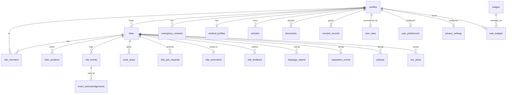

# RideInSync — Data Model

The shared foundation every flow branch builds on. **Source of truth:**
`supabase/migrations/0001_foundation.sql`. TypeScript mirror:
`src/lib/database.types.ts` (regenerate with the CLI once the project exists) +
`src/lib/models.ts` (import your types from here).

Scope = v2 must-haves across Flows 1–7 **plus** the gap-analysis P0 items
(privacy/visibility, document storage, consent, ride-history). Nice-to-haves
(accelerometer, open-ride browse, social share, solo-rider, mesh, voice chat)
are out of this migration but the schema is left extensible for them.

---

## How to work on your branch

1. Branch from `main` after this migration lands.
2. **Own only your tables** (matrix below). To add columns/tables for your flow,
   add a **new** migration `supabase/migrations/000N_<flow>.sql` — never edit
   `0001_foundation.sql`.
3. **Seam tables** (`profiles`, `rides`, `ride_members`, `rider_positions`,
   `ride_events`, `event_acknowledgements`) are shared. Do **not** `ALTER` them
   on your branch without a quick review — that's where merge conflicts and RLS
   breakage come from.
4. Import types from `src/lib/models.ts`. Query through `src/lib/supabase.ts`
   (typed `createClient<Database>`).

---

## Ownership matrix

| Flow / Owner | Owns (safe to alter via a new migration) | Reads (do not alter) |
| --- | --- | --- |
| **1 Onboarding — Mithul** | `emergency_contacts`, `medical_profiles`, `vehicles`, `documents`, `consent_records`, `route_stops`, `ride_join_requests`, ride-creation columns on `rides` | `profiles`, `rides`, `ride_members` |
| **2 Dashboard — Mithul** | `user_stats`, `badges`, `user_badges`, `user_preferences`, `privacy_settings` | `profiles`, `ride_summaries` |
| **3 Trip View — Rajat** | `ride_members`, `rider_positions`, `rides` settings columns | `rides`, `profiles`, `route_stops` |
| **4 Signals — Pratyusha** | `stoppage_reports`, `separation_events`, `pitstops` | `ride_members`, `ride_events`, `event_acknowledgements` |
| **5 SOS — Shubham** | `sos_alerts` | `separation_events`, `stoppage_reports`, `event_acknowledgements`, `medical_profiles` |
| **6 Ending — Gaurav** | `ride_summaries`, `ride_feedback` | `rides`, `user_stats`, `user_badges` |
| **7 GTM/Demo — Mithul + all** | `supabase/seed.sql`, `analytics_events`, `is_demo` usage | everything (read-only) |

> Flow 3 and Flow 4 both touch `ride_members.status` (rider status controls) and
> `ride_events` (signals). Treat those two as the primary integration seam:
> Flow 3 writes position + roster; Flow 4/5 write events and read the roster.

---

## Conventions

- `uuid` PKs via `gen_random_uuid()`; `rider_positions`/`analytics_events` use
  `bigserial` (high-volume append-only).
- `created_at` / `updated_at` are `timestamptz`; `updated_at` is maintained by the
  `set_updated_at()` trigger on mutable tables.
- Every status/role/kind is a Postgres `enum` (see the migration header) so the
  set of values is enforced in the DB and mirrored 1:1 in `database.types.ts`.
- **RLS is ON for every table.** Access is membership-scoped through
  `is_ride_member(rid)` / `is_ride_leader(rid)` (`SECURITY DEFINER`). Cross-member
  writes are gated on `user_id = auth.uid()`.
- Personal data (`medical_profiles`, `emergency_contacts`, `documents`) is
  **owner-only** at the RLS layer. Lead/sweep access to a rider's medical/contact
  info (Flow 5) must go through a `SECURITY DEFINER` view/RPC that honors
  `privacy_settings` — added on Flow 5's branch, not as a broad table policy.
- Joining is via RPC, not raw insert: `request_join_ride(code)` →
  `approve_join_request(request_id)` (leader-only). Demo rides auto-approve.

---

## Entity relationships



---

## Roles

`member_role` = `leader | co_leader | sweep | rider`. v1 enforces **one leader and
one sweep per ride** via partial unique indexes; `co_leader` and extra riders are
unconstrained. Multi-leader (Part 1 decision) turns on later by relaxing nothing —
just start assigning `co_leader`; permission checks already use
`is_ride_leader()` which includes `co_leader`.

---

## RLS smoke tests

Run in the Supabase SQL editor as an authenticated (or anon/guest) session.

```sql
-- A non-member cannot see a ride by its code (returns 0 rows under RLS):
select * from rides where code = 'DEMO01';

-- Join goes through the RPC, not a select+insert:
select request_join_ride('DEMO01');       -- demo ride auto-approves → membership created

-- You can insert your own position, but not another rider's:
insert into rider_positions (ride_id, user_id, lat, lng)
values ('<ride>', auth.uid(), 12.97, 77.59);        -- ok
insert into rider_positions (ride_id, user_id, lat, lng)
values ('<ride>', '<someone-else>', 12.97, 77.59);  -- blocked by RLS

-- Another rider's medical profile is not readable (owner-only):
select * from medical_profiles where user_id = '<someone-else>';   -- 0 rows
```

---

## Applying the schema

```bash
# Local: with Supabase CLI installed and Docker running
supabase start
supabase db reset          # applies 0001_foundation.sql + seed.sql

# Regenerate TS types from the running DB (overwrites the hand-authored file)
supabase gen types typescript --local > src/lib/database.types.ts

# Remote: paste 0001_foundation.sql into the SQL editor, then seed.sql
```

See `ARCHITECTURE.md §8` for the one-time Supabase project + auth setup.
